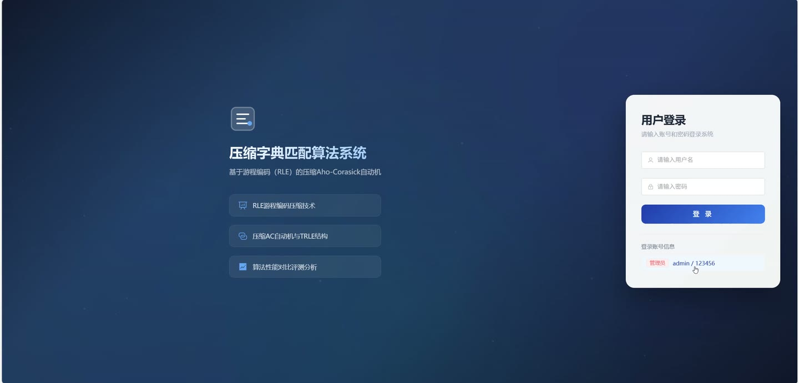
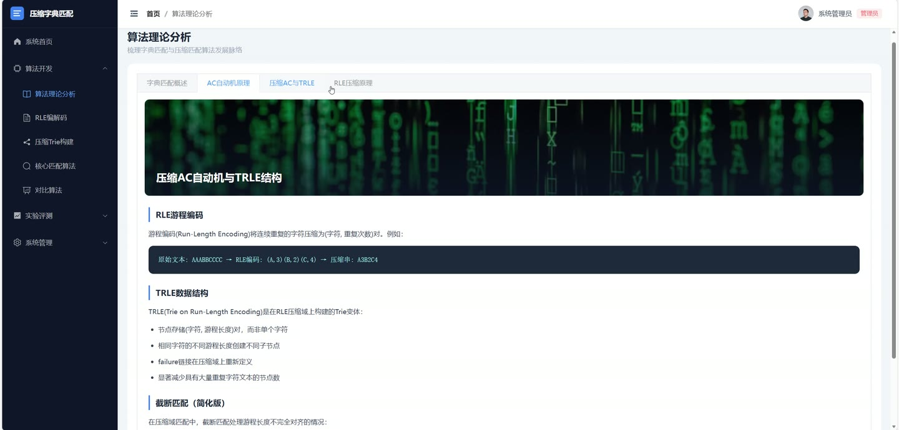
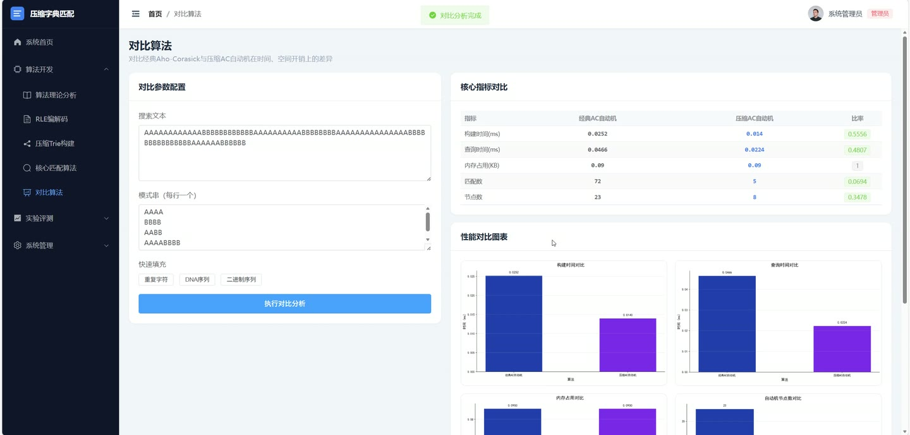
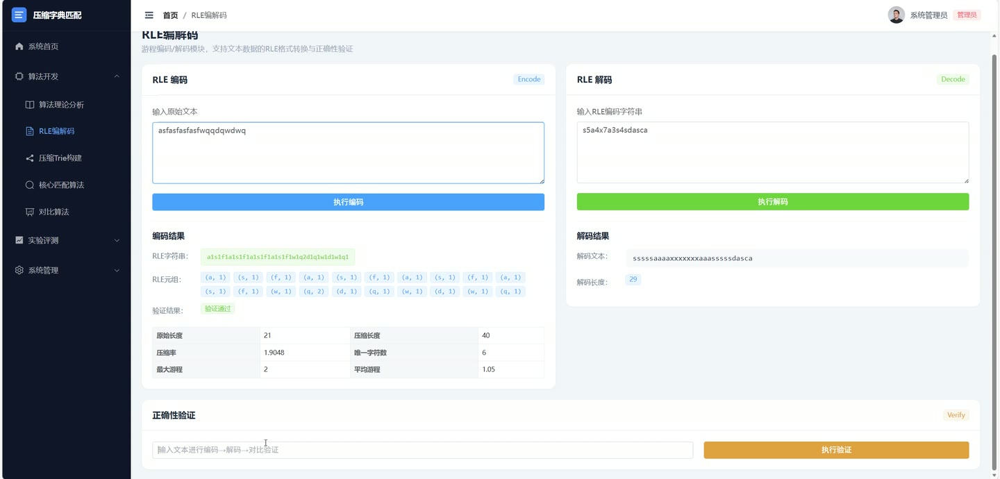
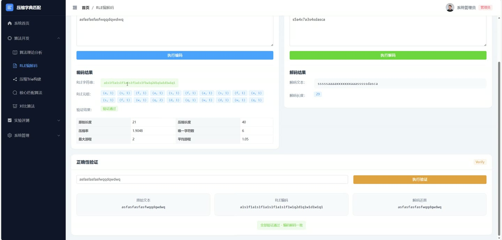
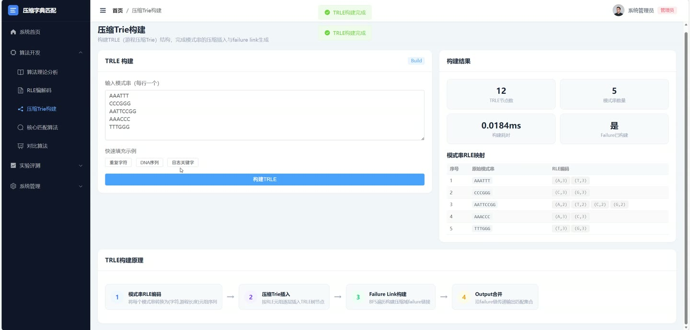

# (附文档)Python+Vue3+MySQL 基于游程编码的压缩字典匹配算法系统

**技术栈**：Python、Flask、Vue3、MySQL

### 系统简介

本系统是一套基于游程编码（RLE）与压缩字典匹配算法的可视化实验平台，采用前后端分离架构，后端基于 Python Flask 提供 RESTful 接口，前端基于 Vue3 与 Element Plus 构建交互界面。系统围绕 RLE 编解码、压缩 Trie（TRLE）构建、核心匹配算法、经典 AC 与压缩 AC 对比、数据集管理、实验评测、日志与系统管理等能力展开，并区分普通用户端与管理员端两类角色。
 
### 核心功能
 
### 普通用户端

 
- 系统首页概览：展示数据集、实验总数、测试用例、Bug 日志四类统计卡片，并列出最近实验与最近操作日志。 
- 算法理论分析：以标签页形式查看字典匹配概述、AC 自动机原理、压缩 AC 与 TRLE、RLE 压缩原理等理论内容。 
- RLE 编解码：输入文本执行游程编码与解码，查看编码结果与压缩效果。 
- 压缩 Trie 构建：输入每行一个模式串，构建 TRLE 结构，查看 TRLE 节点数、模式串数量、构建耗时与 Failure 是否已构建。 
- 模式串 RLE 映射查看：以表格展示每个原始模式串对应的 (字符, 游程长度) 元组序列。 
- 核心匹配算法：在压缩域上执行字典匹配，返回匹配结果。 
- 对比算法分析：配置搜索文本与模式串，一键执行经典 AC 与压缩 AC 对比，查看构建时间、查询时间、内存占用、匹配数、节点数及比率。 
- 对比结果图表：查看自动生成的性能对比图表，并支持点击放大预览。 
- 快速填充示例：在对比与构建页面一键填充重复字符、DNA 序列、二进制序列、日志关键字等示例数据。 
- 数据集管理：新增、编辑、删除、查询数据集，支持按名称关键字与分类筛选，查看数据集详情。 
- 数据集 RLE 预处理：对指定数据集一键执行 RLE 压缩预处理并保存压缩结果。 
- 数据集图片上传：为数据集上传本地预览图并填写图片 URL。 
- 实验评测：新建实验并选择关联数据集或自定义文本与模式串，选择算法类型（对比/经典 AC/压缩 AC）。 
- 运行实验：对待运行状态的实验一键运行，自动记录构建时间、查询时间、内存占用与匹配数等指标。 
- 实验结果查看：查看实验性能指标对比表、摘要对比表、对比图表以及文本长度、模式串数量、RLE 压缩率、节点缩减率等信息。 
- 实验详情与编辑：查看实验基础信息与结果列表，编辑实验名称、描述、关联数据集与算法类型。
 
### 管理员端

 
- 日志管理：查看系统操作日志列表，按条件检索并浏览日志动作、操作者与时间。 
- 测试用例管理：维护测试用例数据，支持新增、编辑、删除与分页查询。 
- Bug 日志管理：新增、编辑、删除 Bug 记录，支持按关键字、严重度、状态筛选。 
- Bug 详情查看：查看 Bug 标题、模块、严重度、状态、报告者、修复者、描述、解决方案与截图。 
- Bug 截图上传：支持填写图片 URL 或本地上传截图并预览。 
- Bug 状态流转：在待处理、修复中、已解决、已关闭之间切换状态并记录解决时间。 
- 系统监控：查看系统运行状态相关监控信息。 
- 数据备份：一键创建数据库全量备份，备份文件保存至服务器指定目录。 
- 备份记录管理：分页查看备份文件名、类型、文件大小、操作者、状态、描述与备份时间。 
- 仪表盘统计：查看待处理 Bug 数量、已完成实验数量等汇总指标与最近动态。
 
### 技术栈

 后端框架Python + Flask 认证鉴权Flask-JWT-Extended + Werkzeug 密码哈希 跨域处理Flask-CORS 数据访问原生 SQL + sqlite3 封装（query_db / execute_db / paginate_query） 数据库SQLite（WAL 模式、外键约束） 前端框架Vue3 + Element Plus 路由管理Vue Router（含登录路由守卫） 构建工具Vite 图表与可视化后端生成对比图表 + 前端图片预览
 
### 交付内容

 
- 后端完整源码 
- 前端完整源码 
- 数据库初始化脚本 
- 万字文档

## 界面展示

---

## 获取完整源码 + 万字文档

本仓库为项目介绍页。**完整前后端源码、数据库初始化脚本、万字项目文档**，请加微信 `kangkangcode`，或访问 [codekk.top](http://codekk.top) 获取。

可作课程设计 / 毕业设计参考，支持远程部署调试。